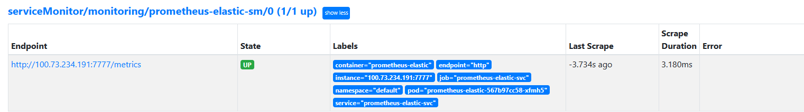
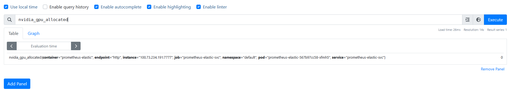

# elasticTraining
在k8s集群上，使用HPA进行pytorch弹性训练，基于GPU的数量进行增加和减少任务pod

## (1)部署expoter进行GPU资源监控
```
kubectl apply -f deployment/deploy.yaml
```
- 通过查询prometheus的targets可以看到自定义的exporter已经集成到prometheus中。


- 在查询界面也能正确获取自定义指标。


## (2)修改prometheus-adapter的配置文件
